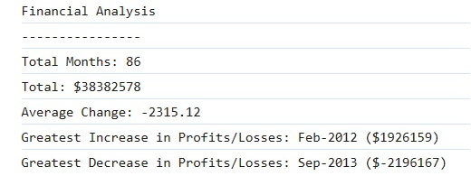

# Console-Finances
Challenge 4 of edX Boot Camp (Front End) to create Javascript code for analyzing the financial records of a company.

## Description

For Weekly Challenge 4 of the edX Bootcamp Front End Course, I was given 
a task of Javascript code for analyzing the financial records of a company. 
The Financial dataset was provided in the 'starter/index.js'.

> What was my motivation?

My motivation was to accelerate my front end skills in web development so I can successsfully secure a web development job. 
I am building on my skills and each week I'm growing from strength to strength.

>Why I built this project?

Building the website helped me to bridge the gap between theoretical knowledge and practical of applying
my Javascript knowledge that I learnt in Week 4.

> What problem did it solve?

It solved the problem of analysing the financial records of a company and then providing some output as required by the specification.

> What did I learn?

I learnt how to write Javascript that is clean, readable, with comments and is maintainable.

> What makes my project stand out? 

It stands out as I have successfully completed the exercise, used good programming practice, in terms of writing clean code.
I have used appropriate constants and variables that are understandable. There are comments throughout the code
so it can be understood by any developer.

> Technologies Used

* HTML
* Javascript

> Tools Used

* Microsoft Windows 11
* Visual Studio Code
* Git and GitBash
* Git Lab
* Git Hub
* Slack
* Google Chrome Browser
* Notepad
* Windows File Explorer
* Microsoft Paint

## Installation

The GitHub repository for my portfolio website can be found at: https://github.com/timsbootcamp/Console-Finances

The source code can be cloned from the above link. 

## Usage

Link to my GitHub Repository: https://github.com/timsbootcamp/Console-Finances

Link to deployed site of my solution to Week 4 : Console Finances Challenge : https://timsbootcamp.github.io/Console-Finances/

## Credits

Programming with Mosh
JavaScript Tutorial for Beginners: Learn JavaScript in 1 Hour 
https://www.youtube.com/watch?v=W6NZfCO5SIk

